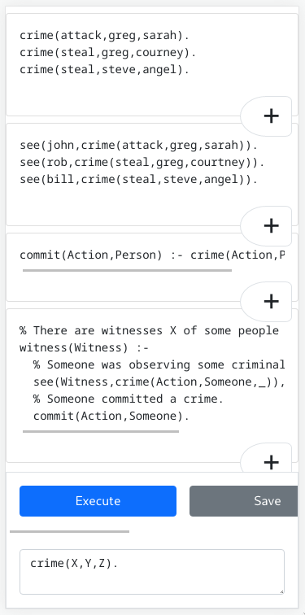
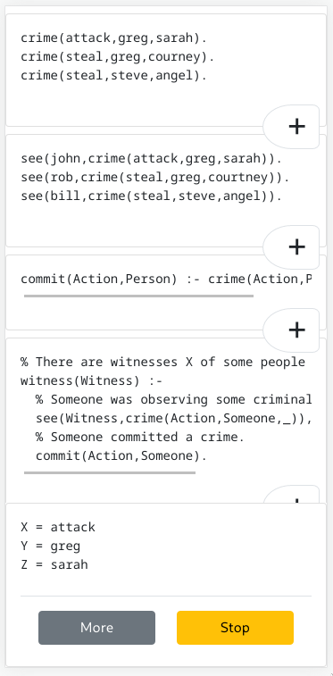

# Paízo Prolog

Pronounced "Pay-zo Prolog".

https://lf94.github.io/paizo-prolog/

Paizo is a playground for Prolog users. It's intended to be used for those
quite moments in life where you have a few minutes, or when in a heated debate
you would do much better with a programmatic reasoner in your pocket.

## Features

* First-class mobile design
* Offline-only (other than to get the initial application)
* Zero external requests
* Themeable
* Save to file
* Load from file
* Designed to balance between context and focus
* All code inlined for easy web application saving

## Possible improvements

* Animations
* Toggle dark/light mode
* Auto-detect environment to load proper Bootstrap UI theme
* Support more languages
  * Change the name to "Paizo Programmer"

### Running your own instance

Simply open `index.html` in your web browser.

### Development

You must first run `npm install`.

Make your changes, run `npx webpack`, and open the new `index.html`.

Look at `design/` for how the application was designed.

